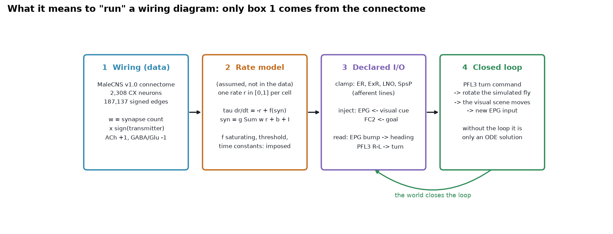
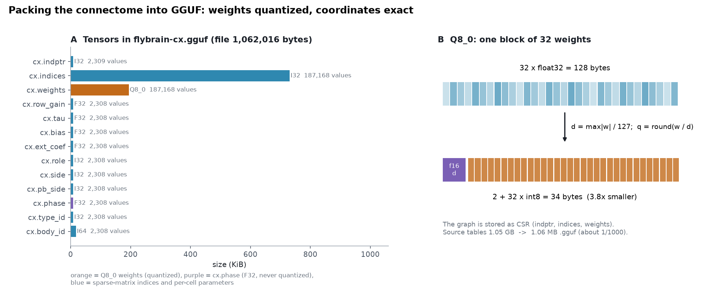
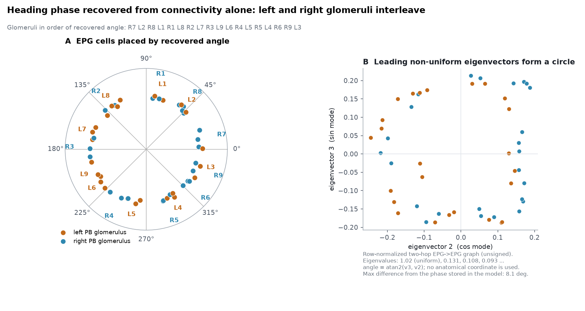
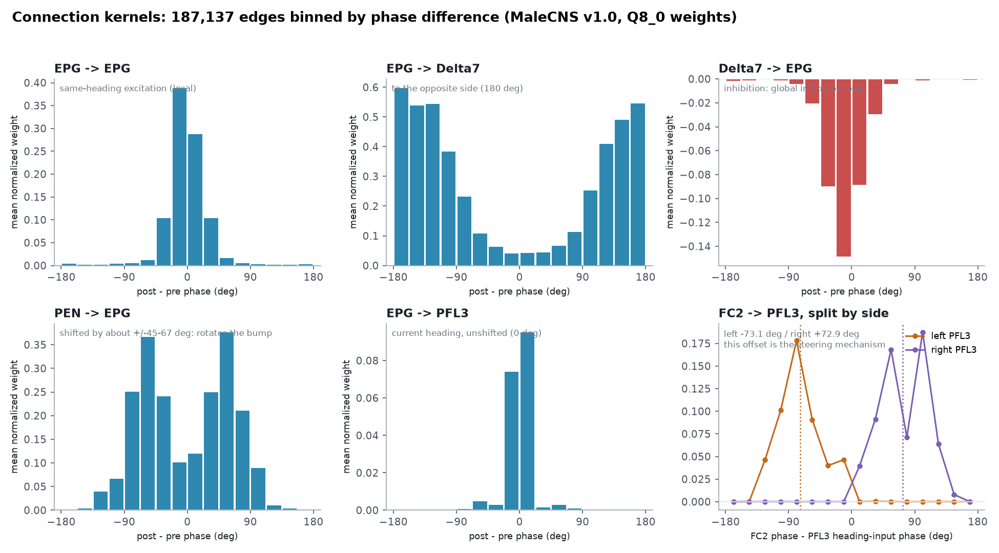
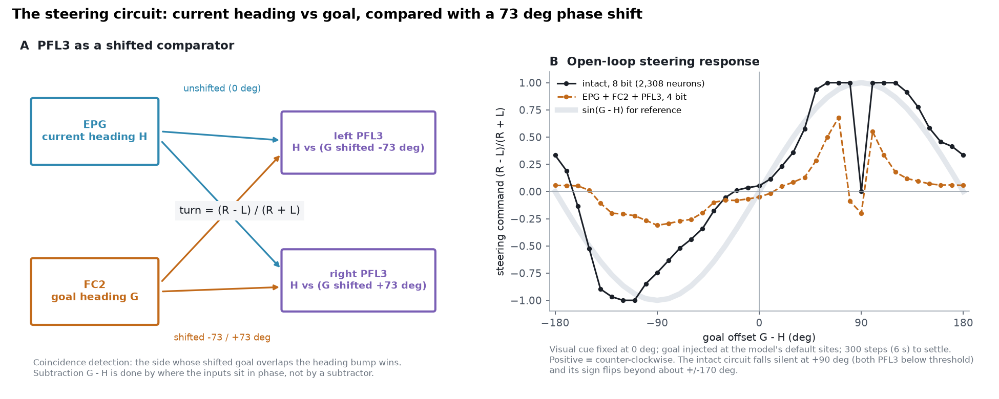
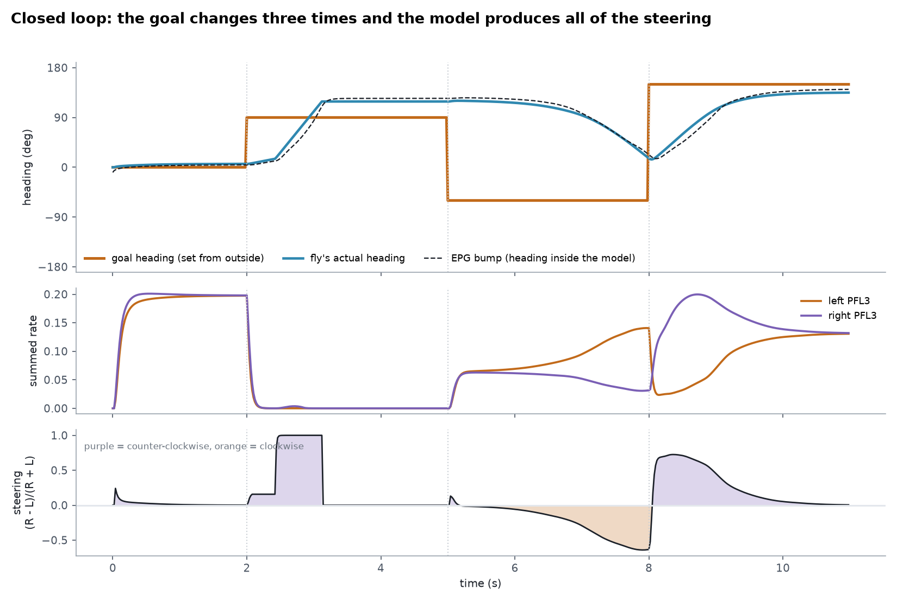
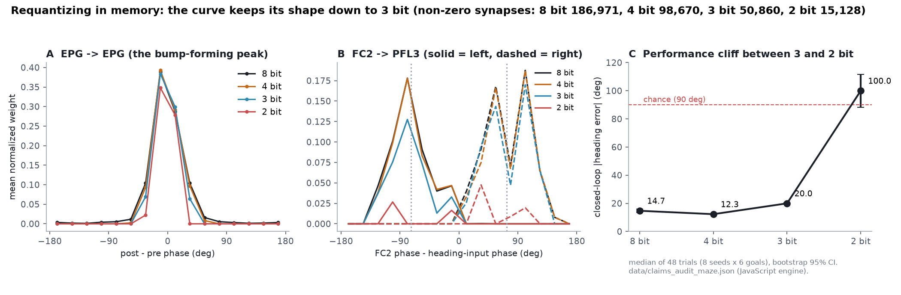
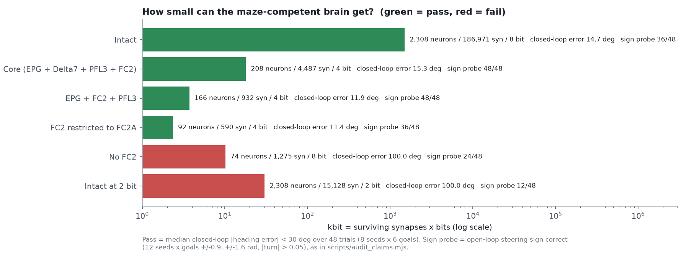

# The navigation algorithm is in the wiring: a 1 MB, browser-executable central complex from the *Drosophila* MaleCNS connectome

**Project paper A** · September 2026
Data: Janelia FlyEM **MaleCNS v1.0** (CC-BY 4.0) · Code, data and figures: this repository (`paper/`)

---

## Abstract

A connectome says who contacts whom, with how many synapses and which predicted transmitter. It says nothing about synaptic strength, time constants or thresholds, so on its own it does not compute anything. We ask how much of a navigation algorithm can be read directly from such a wiring diagram, and how little of it is needed to steer.

We extracted the central complex (CX) of the male *Drosophila* nervous system from MaleCNS v1.0, **2,308 neurons in 118 cell types joined by 187,137 signed connections**. We stored it as a sparse matrix in a GGUF container with **Q8_0 block-quantized weights (a 1,062,016-byte file)**, and ran it as a rate model in a dependency-free JavaScript engine in the browser, with a numerically matched Python engine for analysis. Only the weights come from the connectome. The activation function, time constants, thresholds and input/output sites are declared model assumptions.

Four results follow. **(1) Heading phase can be recovered from connectivity alone.** A spectral embedding of the two-hop EPG→EPG graph places the 50 EPG cells on a ring, and left and right protocerebral-bridge glomeruli interleave around it. No anatomical coordinate is used. **(2) The canonical motifs appear as measured connection kernels.** When the 187,137 edges are binned by phase difference, they show local excitation (EPG→EPG), global inhibition through Δ7, a ±45–67° rotational offset through PEN, and an unshifted heading input to PFL3. The goal input arrives from FC2 shifted by **−73.1° (left PFL3) and +72.9° (right PFL3)**, the shifted-comparator geometry reported electrophysiologically. **(3) The model steers in closed loop.** Given only a goal heading, it turns a simulated fly to within **14.7° [13.4, 16.1]** (median of 48 trials). An independent Python replication gives the same value. **(4) Quantization is pruning, and the phase map is what matters.** Requantizing in memory to 4 bit zeroes **47.2%** of synapses with no loss of steering (12.3°). The cliff lies between 3 bit (20.0°) and 2 bit (100.0°, chance), and what breaks is the shape of the kernel; the phase map is stored in F32 and never changes. A circuit of **166 neurons and 932 synapses at 4 bit (3.7 kbit, about 1/400 of the intact model)** still steers (11.9°, sign correct in 48/48 probes).

We report two corrections to our own earlier numbers. The −0.1° balance point is a *structural* quantity; the running network balances at −22.5°. And which circuit counts as "minimal" depends on the criterion: restricting FC2 to FC2A fails an open-loop sign probe (36/48) yet steers in closed loop (11.4°).

---

## 1. Introduction

The central complex is the fly's navigation centre. Physiology and anatomy together have produced a clear textbook picture of it. Compass neurons (EPG) hold a bump of activity whose position encodes heading [Seelig & Jayaraman 2015; Hulse et al. 2021]. A ring of inhibitory Δ7 neurons keeps that bump single. PEN neurons shift it when the fly turns. PFL3 neurons compare the current heading with a goal heading held by FC2 and output a left/right steering command [Westeinde et al. 2024; Mussells Pires et al. 2024].

That picture was assembled from recordings, silencing experiments and connectomes of the female brain. Here we ask a narrower question: **given only a wiring diagram, how much of the algorithm can be recovered, and how little of the wiring does it take to steer?**

We had two aims.

1. **Make the circuit small and fast enough to experiment with interactively.** If the navigation centre of a fly brain fits in about a megabyte and runs at 50 Hz in a browser tab, then "does this wiring support that computation?" becomes a question anyone can try directly.
2. **Keep the assumption layer visible.** Every number we report is labelled either as coming from the connectome or as coming from a modelling choice we made.

We deliberately do **not** train the connectome. Synaptic weights stay at their measured values throughout. What we add is a small set of cell-level parameters that the connectome does not contain, and the declaration of which cells face the world.

---

## 2. The model layered on top of the wiring



**Figure 1.** What it means to "run" a wiring diagram. Only the weights (box 1) are data. The rate model, the input/output declaration and the closed loop are assumptions we state explicitly.

### 2.1 Rate model

Each neuron carries a single dimensionless rate r ∈ [0, 1]:

$$\tau_i\,\frac{dr_i}{dt} = -r_i + f(\mathrm{syn}_i),\qquad \mathrm{syn}_i = g_i\sum_j w_{ij}\,r_j + b_i + I_i$$

$$f(x) = \frac{x-\theta}{1 + (x-\theta)}\ \text{ for } x > \theta,\qquad f(x) = 0 \text{ otherwise}$$

Only w comes from the connectome: w_ij = (synapse count) × sign(transmitter of the presynaptic cell), with acetylcholine → +1, GABA and glutamate → −1 and monoamines → 0. Each row is then normalised so that its largest |w| is 1. Everything else is imposed: the saturating nonlinearity f, the threshold θ, the time constants (EPG 80 ms, Δ7 30 ms, all others 50 ms), the row gains g and the tonic bias b that stands in for the rest of the brain. Rates are not in Hz, and we make no firing-rate predictions. The claim is about **what the geometry of connectivity computes**.

Integration is forward Euler with dt = 20 ms. One step of the 2,308-unit network takes about 0.3 ms in JavaScript and 0.2 ms in the numpy engine (`scripts/cxnet_np.py`), which reproduces the JavaScript dynamics.

### 2.2 Input and output must be declared

A subgraph cut out of a whole-nervous-system connectome has no marked input or output terminals. Which cells face the world is a biological decision we make:

| Mode | Cells | What happens |
|---|---|---|
| Clamp | ER, ExR, LNO, SpsP | r is set from outside and not integrated (afferent lines) |
| Inject | EPG (visual landmark), FC2 and hΔB (goal) | added to the drive as a cosine bump at the cell's phase |
| Tonic bias | all cells | replaces the amputated rest of the brain (net inhibitory) |

Outputs are read from populations:

```
heading   θ    = atan2( Σ r_i sin φ_i , Σ r_i cos φ_i )    over EPG
steering  turn = (Σ_right − Σ_left) / (Σ_right + Σ_left)   over PFL3
```

The loop is closed through the world: inject the landmark and the goal → step the network → read PFL3 → turn the simulated fly by K·turn·dt (K = 2.6 rad/s) → the landmark moves on the retina → repeat.

---

## 3. Extraction, sign assignment and quantization

### 3.1 The subgraph

From MaleCNS v1.0 we kept every neuron innervating the ellipsoid body, fan-shaped body, protocerebral bridge or noduli. That gives **2,308 neurons in 118 cell types and 187,137 signed edges carrying 1,426,993 synapses**: 136,883 excitatory and 50,254 inhibitory. The major populations are EPG 50, PEN 42, Δ7 42, PFL3 24, PFN 456, hΔ 189, vΔ 430, FC 274 and ER 282. Density is 3.5%, so the matrix is stored in compressed sparse row (CSR) form.

### 3.2 Q8_0 in a GGUF container



**Figure 2.** A: every tensor in `model/flybrain-cx.gguf`. The Q8_0 weights take 194 KiB; the int32 column indices are the largest item. B: Q8_0 stores each block of 32 weights as one f16 scale plus 32 int8 values, 34 bytes instead of 128.

GGUF is best known as a container for language models, but it is simply metadata plus typed tensors. We store the CSR arrays (`cx.indptr`, `cx.indices`, `cx.weights`), per-cell parameters, and `cx.phase`, each cell's preferred heading. **`cx.weights` is Q8_0; `cx.phase` is F32 and never quantized.** The coordinate system is exact; only the landscape drawn on it is coarsened. This split is what makes Section 5 possible. The pipeline takes the 1.05 GB of source tables to a 1,062,016-byte file, about 1/1000 of the original.

No existing runtime reads a GGUF file as a sparse graph in a browser, so the reader and the inference engine are written from scratch with zero dependencies (`web/gguf.js`, `web/cxnet.js`).

---

## 4. Result I: the wiring already contains the navigation algorithm

### 4.1 Phase recovered from connectivity alone



**Figure 3.** A: the 50 EPG cells placed at the angle recovered from connectivity, coloured by the side of the protocerebral bridge (PB) their glomerulus lies on. B: the two eigenvectors whose ratio gives that angle.

The heading each EPG cell prefers is not written in the connectome. We recover it as follows. Take the unsigned two-hop EPG→EPG graph (EPG → any cell → EPG, plus the direct connections), symmetrise it and normalise its rows. For a ring attractor this matrix is close to circulant, so its leading non-uniform eigenvectors come out as a cosine–sine pair (eigenvalues 0.131 and 0.108 after the uniform mode at 1.02). The angle atan2(v₃, v₂) is each cell's phase.

The recovered order is **R7 L2 R8 L1 R1 L8 R2 L7 R3 L9 L6 R4 L5 R5 L4 R6 R9 L3**. Left and right glomeruli interleave, and each side runs through its glomeruli in sequence (right 7-8-1-…-6, left 2-1-8-…-3), as in the known wedge anatomy of the ellipsoid body. The two extra glomeruli, L9 and R9, sit at the seams. **This is a recovery, not an assumption:** no anatomical coordinate enters it. Phases then propagate to other cell types through glomerulus and column labels and, where there are no labels, through connectivity. In total **2,110 of the 2,308 neurons** receive a phase (1,675 from labels, then 375 and 60 in two rounds of propagation).

Recomputing the embedding from `data/cx_network.npz` reproduces the phases stored in the model to within 8.1° (float32 versus float64).

### 4.2 Connection kernels



**Figure 4.** Mean normalised weight as a function of the phase difference between postsynaptic and presynaptic cells. Pairs with no connection count as zero.

Binning every connection by pre–post phase difference turns 187,137 edges into a handful of interpretable curves:

- **EPG → EPG** peaks sharply at 0°: local excitation, which is why a single bump forms.
- **EPG → Δ7** peaks at ±180°, and **Δ7 → EPG** is negative around 0°. Together they form global inhibition, which is why the bump does not split.
- **PEN → EPG** has twin peaks about ±45–67° off centre: the offset feedback that rotates the bump when the fly turns.
- **EPG → PFL3** peaks at 0°: current heading reaches the steering neurons unshifted.
- **FC2 → PFL3**, measured relative to each PFL3 cell's heading input, peaks at **−73.1° for left PFL3 and +72.9° for right PFL3**.

"Local excitation, global inhibition, offset feedback" is the textbook design of a ring attractor. Here it comes out of a measurement.

### 4.3 PFL3 as a shifted comparator



**Figure 5.** A: the minimal steering circuit. B: the open-loop steering command as a function of the goal offset, for the intact network and for the 166-neuron circuit of Section 5.1.

Each PFL3 cell receives the current heading unshifted and the goal shifted by ∓73°. Acting as a coincidence detector, right PFL3 wins when the goal lies counter-clockwise of the heading, and left PFL3 wins when it lies clockwise. **The subtraction G − H is carried out by where the inputs sit in phase, not by a subtraction circuit.** The mean of the two offsets, **−0.1°**, is the *structural* balance point: the goal offset at which the two sides would receive equal drive. The male connectome's ±73° is close to the ±70–90° reported physiologically in the female brain [Westeinde et al. 2024].

Figure 5B shows the response of the running network. Near zero it has the shape of sin(G − H), and it saturates at ±1 for offsets beyond about 45°. It also shows two features that a pure sine lacks. At +90° **both PFL3 populations fall below threshold** and the command drops to zero. Beyond about ±170° the sign flips. Both are dead zones of the rate model at this operating point. They are not in the wiring.

### 4.4 Closed-loop behaviour



**Figure 6.** The goal heading (orange) is changed three times from outside. The simulated fly's heading (blue), the EPG bump (dashed), the two PFL3 populations and the steering command are all produced by the network.

In closed loop the only external command is the goal heading; the network produces all steering. The EPG bump tracks the fly's heading because the landmark is injected at the right place on the ring. The simulated fly converges on each new goal with a residual. Over 48 trials (8 initial-state seeds × 6 goals between ±30° and ±170°), the median |error| is **14.7° [13.4, 16.1]** (bootstrap 95% CI), with a **systematic bias of −7.0°** (`data/claims_audit_maze.json`). Our Python replication of the same protocol (`paper/scripts/fig_a.py`) gives 14.7° [13.4, 16.1] as well.

The residual has two sources, both visible in Figure 6. One is the dead zone of Section 4.3: during the second goal, turning stops about 30° past the target when PFL3 goes silent. The other is a systematic bias: **the running network's balance point is −22.5°** (bisection over 24 seeds, `data/claims_audit_maze.json`), not the structural −0.1°. We have not isolated which of the imposed parameters (thresholds, tonic bias, the hΔB goal input) produces the shift.

---

## 5. Result II: quantization is pruning, and the phase map is what matters



**Figure 7.** Requantizing the weights in memory, row by row (the file is never rewritten). A, B: kernels at 8, 4, 3 and 2 bit. C: closed-loop heading error, median of 48 trials with bootstrap 95% CI.

Requantizing the dequantized weights *in memory* lets us sweep precision on a fixed substrate. Each row is scaled by its largest |w| and rounded to 2^(bits−1) − 1 levels, exactly as `applyWeightBudget` in `web/cxnet.js` does.

- The EPG→EPG peak survives at 8, 4 and 3 bit, and narrows at 2 bit.
- FC2→PFL3 keeps its twin peaks at 8, 4 and 3 bit. **At 2 bit the curve collapses to a few isolated bins**, and the comparator is gone.
- Closed-loop error is **14.7° [13.4, 16.1] at 8 bit, 12.3° [12.2, 12.4] at 4 bit, 20.0° [19.5, 20.4] at 3 bit, and 100.0° [88.3, 111.7] at 2 bit**, which is chance.

The circuit needs **a peak in the right place as a function of phase difference**; the exact height of the peak matters much less. Because the phase is stored in F32 and never quantized, coarsening the weights degrades the landscape but never the coordinates. That is why the cliff is so sharp and comes so late.

At 4 bit, any weight below 1/14 of its row maximum rounds to zero. That deletes **47.2% of the synapses (186,971 → 98,670)** with no loss of performance; the error even falls slightly, from 14.7° to 12.3°. **Here quantization is pruning:** the weak edges were not carrying the task. At 3 bit, 50,860 synapses survive; at 2 bit, 15,128.

### 5.1 How small can the steering circuit get?



**Figure 8.** Circuit size (surviving synapses × bits) against two criteria: closed-loop error (pass if the median is below 30°, fixed before the table was computed) and an open-loop sign probe (steering sign correct in 48 probes).

We combined cell-type ablation with bit depth. The size score is surviving synapses × bits.

| Configuration | Neurons | Synapses | Bits | kbit | Closed-loop error | Sign probe |
|---|---:|---:|---:|---:|---:|---:|
| Intact | 2,308 | 186,971 | 8 | 1,496 | 14.7° | 36/48 |
| Core (EPG + Δ7 + PFL3 + FC2) | 208 | 4,487 | 4 | 17.9 | 15.3° | 48/48 |
| **EPG + FC2 + PFL3** | **166** | **932** | **4** | **3.7** | **11.9°** | **48/48** |
| FC2 restricted to FC2A | 92 | 590 | 4 | 2.4 | 11.4° | 36/48 |
| No FC2 (EPG + PFL3) | 74 | 1,275 | 8 | 10.2 | 100.0° | 24/48 |
| Intact at 2 bit | 2,308 | 15,128 | 2 | 30.3 | 100.0° | 12/48 |

The three populations that survive are exactly the three computations the task needs: **current heading (EPG), goal heading (FC2) and the comparison (PFL3)**. At **3.7 kbit this circuit is about 1/400 of the intact model** (1,496 kbit), and it passes both criteria.

The table also contains two results that change how "minimal" should be read.

- **The intact network fails the open-loop sign probe (36/48).** The probe asks for the correct sign with |turn| > 0.05 at goal offsets of ±0.9 and ±1.6 rad. At +1.6 rad (92°) the intact network sits in the dead zone of Figure 5B and outputs zero. The probe is informative for small circuits, but it is not a behavioural test.
- **FC2A alone fails the probe but passes in closed loop (11.4°).** Under the closed-loop criterion, the smallest competent circuit we found is 2.4 kbit, not 3.7. We report 3.7 kbit as the smallest circuit that passes *both* criteria. We did not search below it.

**Removing Δ7 breaks steering.** Starting from the intact 14.7°, ablating Δ7 gives **106.7° [104.2, 109.2]**; ablating ER alone gives 15.3°, and ablating both Δ7 and ER gives 105.8° [94.2, 117.3]. Yet the EPG + FC2 + PFL3 circuit, which has no Δ7 at all, steers. Δ7 is necessary in the context of the full network, not for the comparison itself. We have not tested which part of the full network makes it necessary.

---

## 6. Limitations

- **Units and parameters.** Rates are dimensionless. Thresholds, time constants, row gains and the tonic bias were chosen by grid search, not constrained by physiology. The claims concern the geometry of connectivity, not the magnitudes.
- **Signs are predictions.** Transmitter identities are the connectome's predicted labels; glutamate is treated as inhibitory (through GluCl) throughout.
- **The landmark map is ours.** Measured ER directional selectivity on the graph is essentially zero (median R = 0.07), consistent with this mapping being learned through ER→EPG plasticity in the fly [Kim et al. 2019]. The strength of the visual cue stands in for that learned map.
- **No bump in darkness.** The effective EPG→EPG coupling has the Mexican-hat shape a ring attractor needs, but with this rate model and ER's tonic inhibition the bump decays when the landmark is removed. Heading in the maze is therefore **landmark-driven, not self-sustained**.
- **The goal is injected into FC2 and hΔB by default.** This is the configuration used for every number in this paper. A goal injected into FC2 alone gives a closed-loop error of 16.4° [14.8, 22.1], within the confidence interval of the default (17.9° [15.7, 22.3]) in a separate 48-trial protocol (`data/servo_confound.json`). The minimal circuits contain no hΔB, so for them the goal enters through FC2 only.
- **Structural versus running quantities.** The ±73° kernel offsets and the −0.1° balance point are measurements of wiring. The running network balances at −22.5° and carries a −7.0° bias. The kernel peaks also have wide cell-bootstrap intervals (left −73.1° [−84.6, −58.1], right +73.0° [+58.1, +88.4]; `data/claims_audit_wiring.json`), so precision beyond about ±15° is not warranted.
- **Corrections to earlier project reports.** An earlier version of this analysis stated that "removing ER as well makes Δ7 dispensable". That does not reproduce (105.8°), and it is retracted. The −0.1° balance point was earlier presented as behavioural; it is structural. Earlier documents also quote the model file as 1.04 MB; the file in this repository is 1,062,016 bytes.

---

## 7. Conclusion

A connectome plus a declared layer of assumptions is enough to recover a navigation algorithm. The heading ring can be read from the wiring without coordinates. The ring-attractor motifs and the shifted comparator appear as measured kernels. The running model steers to a goal in closed loop. What the task needs is **a peak in the right place as a function of phase**: the phase map is exact while the weights can be coarsened to 4 bit and half of them deleted. Three populations, EPG, FC2 and PFL3, joined by 932 synapses, are enough to steer.

The same machinery raises the next question: can the circuit steer by *where the fly is going* rather than *where it is pointing*? We address that in the companion paper B.

---

## Reproduction

```
pip install numpy scipy matplotlib markdown
python3 paper/scripts/fig_a.py         # measurements + figures (about 2 minutes)
python3 tests/test_papers_en.py        # checks every number in this paper against the data
node scripts/audit_claims.mjs          # the 48-trial closed-loop audit (JavaScript engine)
python3 -m http.server 8000            # then open http://localhost:8000/web/ for the maze
```

All numbers measured for this paper are written to `paper/data/paper_a_measurements.json`. The closed-loop audit numbers come from `data/claims_audit_maze.json`, and the extraction counts from `data/cx_extract_report.json`.

## Data and code availability

Connectome: Janelia FlyEM MaleCNS v1.0, CC-BY 4.0, <https://male-cns.janelia.org/>. The derived model (`model/flybrain-cx.gguf`), measurement outputs (`data/*.json`, `paper/data/*.json`), figure scripts (`paper/scripts/`) and the browser engine (`web/`) are in this repository.

## References

1. MaleCNS connectome, Janelia FlyEM and collaborators. Dataset v1.0, CC-BY 4.0. <https://male-cns.janelia.org/>
2. Hulse, B. K. *et al.* A connectome of the *Drosophila* central complex reveals network motifs suitable for flexible navigation and context-dependent action selection. *eLife* **10**, e66039 (2021).
3. Seelig, J. D. & Jayaraman, V. Neural dynamics for landmark orientation and angular path integration. *Nature* **521**, 186–191 (2015).
4. Westeinde, E. A. *et al.* Transforming a head direction signal into a goal-oriented steering command. *Nature* **626**, 819–826 (2024).
5. Mussells Pires, P. *et al.* Converting an allocentric goal into an egocentric steering signal. *Nature* **626**, 808–818 (2024).
6. Kim, S. S., Hermundstad, A. M., Romani, S., Abbott, L. F. & Jayaraman, V. Generation of stable heading representations in diverse visual scenes. *Nature* **576**, 126–131 (2019).
7. Shiu, P. K. *et al.* A *Drosophila* computational brain model reveals sensorimotor processing. *Nature* **634**, 210–219 (2024).
8. GGUF file format specification, `ggml/docs/gguf.md`.
