# Heading servo or travel servo? A control-theoretic reading of coordinate transformation in the *Drosophila* central-complex connectome

**Project paper B** · September 2026
Data: Janelia FlyEM **MaleCNS v1.0** (CC-BY 4.0) · Code, data and figures: this repository (`paper/`)

---

## Abstract

A fly in a crosswind points one way and moves another. If heading is H and the sideslip angle is φ, the travel direction is T = H + φ. A steering controller can feed back H (a *heading servo*) or T (a *travel servo*). Without sideslip the two are indistinguishable; with sideslip only the travel servo reaches the goal. The central complex appears to contain the ingredients of a travel servo. PFNd/PFNv → hΔB is credited with transforming body-frame velocity into a world-frame travel direction [Lyu et al. 2022; Lu et al. 2022], and PFL3 compares a direction with the goal [Westeinde et al. 2024; Mussells Pires et al. 2024]. We ask which controller the male connectome actually implements, and what it would need in order to implement the other.

**Theory.** We treat steering as a closed loop in which sideslip is a disturbance added at the plant output. For the mixed law u = K_H·sin(G − H) + K_T·sin(G − T) we derive four results. The steady error is (1 − ρ)|φ| with ρ = K_T/(K_H + K_T), so ρ is the disturbance-rejection ratio. Stability requires K_H + K_T > 0. The travel servo is globally stable (Lyapunov function 1 − cos e). And the loop has the form of a first-order phase-locked loop, so a rotating sideslip is tracked with lag arcsin((dφ/dt)/K) and lost when |dφ/dt| > K. The coordinate transform T = H + φ is a phasor multiplication (angle addition). A comparator of G against T is a squaring operation (angle subtraction). Both are bilinear, and a purely additive (weighted-sum) stage can implement neither. All results are verified numerically and fixed as regression tests.

**Measurement.** On a rate model of the MaleCNS central complex (2,308 neurons, 187,137 signed edges), the front stage is wired as the literature describes. Four PFNd/PFNv groups write onto hΔB with offsets of **+30°, −22°, −146° and +141°**, and all **19 of 19** hΔB cells receive from all four. **But the stage never operates.** Every self-motion entry is inhibitory, so no row gain gives heading tuning and activity while walking at the same time. In **0 of 16** tested conditions does hΔB carry travel direction (maximum travel gain +0.20). Declaring shunting inhibition wakes PFNv, but it flips each group's preference by 180°, so the four bases collapse forward and the transform still fails. At the same time the closed-loop maze error rises from 19.3° to 99.3°. In the back stage, direct hΔB input is **0.09%** of PFL3's input (32 synapses). A fit of the closed-loop steering gives **K_H = +0.748, K_T = −0.018, ρ = 0.024**: a heading servo. Clamping an ideal travel signal onto hΔB changes nothing (ρ = 0.027). With persistent sideslip the circuit's error is **42.6° [41.4, 43.6]**, next to an ideal heading servo's 40.0°. Theory predicts **43.5°** from the fitted law plus an independently measured floor, inside the confidence interval.

The wiring for a travel servo is a necessary condition that the male connectome meets. It is not sufficient: what is missing are the two multiplications.

**Adding them (Section 7).** We added the two operations to the model as a declared circuit, in two variants: one uses decoded angles, the other uses only cell activities plus a new hΔB → PFL3 projection. Each variant was calibrated once and then frozen. With them, hΔB carries T (held-out a = 1.00, b = 1.00–1.05), although its speed amplitude fails the linearity criterion. The loop becomes a travel servo (ρ = 0.972 / 0.933, K_T > 0), and the sideslip error falls from 42.6° to **17.7° / 14.8°**. Ablations confirm that both multiplications and a correctly signed comparator are necessary. They also show that neither the exact square (threshold rectification suffices) nor the connectome's specific PFN → hΔB pairs is. The improvement survives other seeds, noise, 100 ms of delay and changes of speed and gain.

---

## 1. Introduction

### 1.1 Two controllers that agree until the wind blows

Let the goal direction be G, the heading H and the travel direction T. In still air T = H, and a controller that turns the body toward the goal also moves the fly toward it. A crosswind adds a sideslip φ, and then T = H + φ. The same controller now points the body at the goal and drifts off course by φ.

Two simple laws make the distinction precise:

- **Heading servo:** u = K·sin(G − H) turns the body until it points at the goal.
- **Travel servo:** u = K·sin(G − T) turns the body until the *movement* points at the goal.

In engineering terms the question is **which quantity is fed back**. The answer decides whether sideslip is rejected or passed straight through.

### 1.2 Why the central complex is a natural candidate for a travel servo

The central complex contains the ingredients of both controllers. EPG and Δ7 represent heading H, and FC2 represents the goal G. In the female brain, PFNd and PFNv receive self-motion input from the noduli and project onto hΔB with four phase offsets near ±45° and ±135°. Summing the four as a vector yields an allocentric travel direction [Lyu et al. 2022; Lu et al. 2022]. PFL3 compares a heading-like signal with the goal to produce left/right steering [Westeinde et al. 2024; Mussells Pires et al. 2024]. If hΔB's T reached PFL3's comparator, the whole loop would be a travel servo.

### 1.3 What this paper does

1. It sets up the loop in control-theoretic form and derives what a travel servo requires: which quantity is fed back, what ρ means, the stability condition, the two operations the stages must perform, and the PLL isomorphism (Section 3).
2. It measures the front stage (PFNd/PFNv → hΔB) as a coordinate transformation (Section 4).
3. It measures the back stage (→ PFL3) and identifies the closed-loop control law (Section 5).
4. It checks the theory against the measurements quantitatively (Section 6).
5. It adds the two missing operations as a declared circuit and measures their performance, necessity and robustness (Section 7).

Everything here uses this project's own measurements. The circuit model, its extraction and its validation as a heading-following steering circuit are described in companion paper A.

---

## 2. Model and assumptions

The model is the rate network of paper A: each neuron has a rate r ∈ [0, 1] with

$$\tau_i\,\dot r_i = -r_i + f\!\left(g_i\sum_j w_{ij} r_j + b_i + I_i\right)$$

Here w_ij is the synapse count times the sign of the presynaptic transmitter (acetylcholine +1; GABA, glutamate and histamine −1). f is a thresholded saturating function, and dt = 20 ms. Self-motion enters through the noduli: LNO and SpsP are clamped to the optic-flow drives s_L = v·cos(φ − 45°) and s_R = v·cos(φ + 45°). **φ itself never enters the circuit; only this left/right drive pair does.**

The line between data and assumption:

| Item | Source |
|---|---|
| Presence, synapse count and sign of each edge | **Connectome** (MaleCNS v1.0) |
| Per-type phases and write offsets | **Computed from the connectome** |
| Activation f, gains, time constants, thresholds | Assumed |
| Input sites (landmark → EPG, goal → FC2, self-motion → LNO/SpsP) | Assumed |
| Steering readout u = (R − L)/(R + L) over PFL3 | Assumed |
| Plant Ḣ = K·u, K = 2.6 rad/s | Assumed |
| Sideslip: Ornstein–Uhlenbeck, σ = 55°, τ = 4 s, clipped at ±60° | Assumed (fixed before running) |
| Shunting inhibition (Section 4.3 only) | **Declared mechanism**, not in the data |

---

## 3. Theory: what a travel servo requires

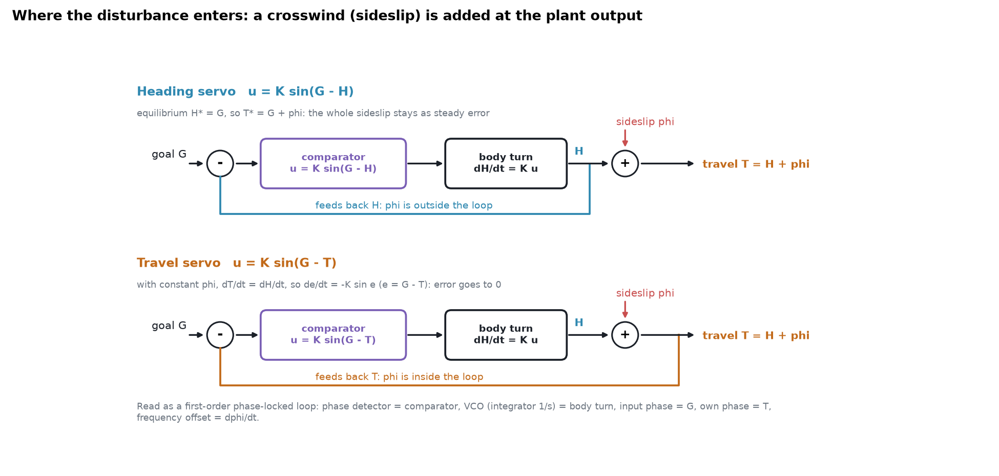

**Figure 1.** The two loops. Sideslip φ is added at the plant output. A heading servo feeds back H, so φ lies outside the loop; a travel servo feeds back T, so φ lies inside.

### 3.1 Plant and disturbance

We simplify the plant to a pure integrator with the sideslip added at its output:

$$\dot H = K\,u,\qquad T = H + \phi$$

This is the standard picture of an **output disturbance**. Feedback can cancel a disturbance only if the disturbance lies inside the loop, that is, only if the fed-back signal contains it.

### 3.2 The heading servo passes sideslip straight through

For u = sin(G − H) the equilibrium is H\* = G, so T\* = G + φ. **The steady travel error equals the sideslip.** The sensor (H) and the controlled quantity (T) differ, and no amount of gain removes a disturbance the loop cannot see.

### 3.3 The travel servo is globally stable

For u = sin(G − T) and constant φ, Ṫ = Ḣ, so with e = G − T

$$\dot e = -K\sin e$$

Take V = 1 − cos e. Then V̇ = −K·sin²e ≤ 0: e = 0 is stable and e = π is unstable. **The steady error is zero whatever φ is.**

### 3.4 The mixed law: ρ is the disturbance-rejection ratio

Real circuits may mix the two:

$$u = K_H\sin(G-H) + K_T\sin(G-T)$$

Using G − H = e + φ,

$$\dot e = -K\left[K_H\sin(e+\phi) + K_T\sin e\right]$$

Linearising for small angles, ė = −K(K_H + K_T)·e − K·K_H·φ, so the steady error is

$$e^* = -\frac{K_H}{K_H+K_T}\,\phi$$

If K_H and K_T are both positive, |e\*| = (1 − ρ)|φ| with ρ = K_T/(K_H + K_T). **ρ is exactly the fraction of sideslip the loop rejects.** A heading servo has ρ = 0; a travel servo has ρ = 1.

**Stability requires K_H + K_T > 0** (more precisely K_H·cos φ + K_T > 0). A sign-blind definition such as ρ = |K_T|/(|K_H| + |K_T|) can approach 1 while K_T < 0. If then K_H + K_T < 0, e = 0 is unstable and the loop settles near e = π, pointing *away* from the goal (Figure 2A, dotted). **A ρ criterion must also require K_T > 0.** We found this hole in our own scoring script (Appendix C).

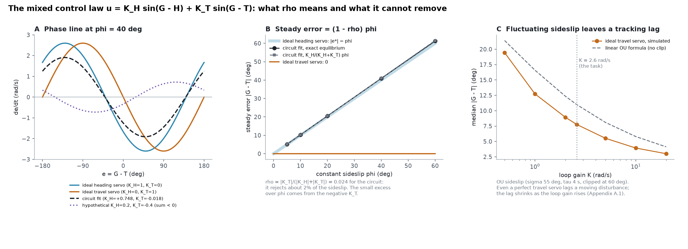

**Figure 2.** A: phase lines at φ = 40°. B: the steady error under constant sideslip for the circuit's fitted law (Section 5.2): exact equilibrium versus the linear formula. C: even an ideal travel servo lags a fluctuating sideslip, and the lag falls as the loop gain rises.

### 3.5 Front stage: multiplying phasors adds angles

The transformation T = H + φ, written with complex numbers, is e^{iH}·e^{iφ}: **a multiplication.** The literature's four PFN bases prefer p_g = ±45° and ±135°, 90° apart. For any φ exactly two adjacent bases are positive, and the following identity holds exactly (here for −45° ≤ φ ≤ 45°):

$$\cos(\phi-45^\circ)\,e^{i45^\circ}+\cos(\phi+45^\circ)\,e^{-i45^\circ}=e^{i\phi}$$

If each group's activity bump is its heading bump scaled by its velocity projection A_g = v·[cos(φ − p_g)]₊, then the sum onto hΔB is

$$Z=\sum_g A_g\,e^{i(H+p_g)} = e^{iH}\,v\sum_g[\cos(\phi-p_g)]_+e^{ip_g}=v\,e^{i(H+\phi)}$$

Numerically, the phase error over the full circle is 1.0 × 10⁻¹³° and the magnitude is 1 (Figure 3A). The derivation shows two requirements.

- **The scaling must be multiplicative.** If velocity and heading are *added*, the e^{iH} term and the velocity term stay separate, and no angle sum appears. Rotation is bilinear.
- **The write phases must match the preferences.** If the offset at which a group writes departs from the direction it prefers, the identity breaks and the travel gain b drifts from 1.

### 3.6 Back stage: squaring subtracts angles

A comparator that steers by G − T must produce a function of the *difference*. Consider a PFL3-like population whose cells, at phase γ, receive [cos(G − γ) + cos(T − γ − δ)]², with δ = +90° on the left and −90° on the right. Averaging over γ,

$$\big\langle[\cos(G-\gamma)+\cos(T-\gamma-\delta)]^2\big\rangle_\gamma = 1+\cos(G-T+\delta)$$

so L ∝ 1 − sin(G − T), R ∝ 1 + sin(G − T), and

$$\frac{R-L}{R+L} = \sin(G-T)$$

This is the ideal travel-servo law. It holds exactly for a discrete population of 12 cells (maximum error 4 × 10⁻¹⁶). **Without the square the information disappears:** each side's input, summed over cells, is identically zero. A square is a self-product; expanding it yields cos a·cos b, which is a function of G − T. The back stage therefore needs a multiplication too.

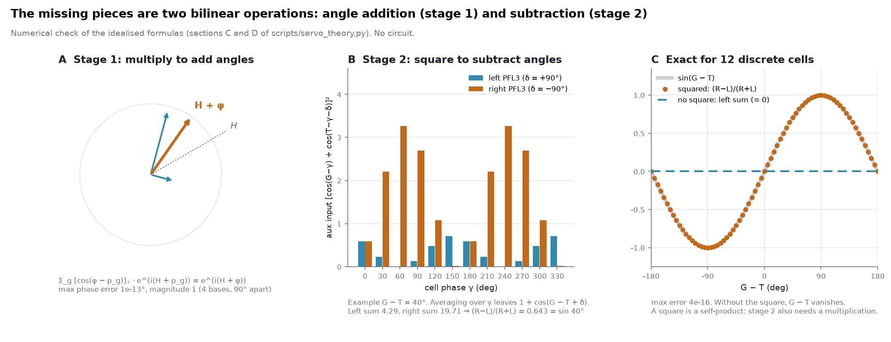

**Figure 3.** The two bilinear operations a travel servo needs. A: multiplication adds angles (front stage). B, C: squaring subtracts them (back stage).

### 3.7 The loop is a first-order phase-locked loop

The travel servo's ė = −K·sin e is the equation of a first-order phase-locked loop (PLL):

| PLL | Travel servo |
|---|---|
| input phase | goal direction G |
| own phase | travel direction T |
| phase detector (a product) | squaring comparator → sin(G − T) |
| VCO (integrator 1/s) | body rotation Ḣ = K·u |
| frequency offset Δω | sideslip rate dφ/dt |

Known PLL results therefore apply directly. For a sideslip that rotates at a constant rate, ė = −K·sin e − dφ/dt, and:

- if |dφ/dt| < K the loop locks with lag arcsin((dφ/dt)/K);
- if |dφ/dt| > K lock is lost and the phase slips cycles.

Simulated lags match arcsin to within 0.1° for (dφ/dt)/K from 0.1 to 0.95 (at 0.5 the lag is exactly 30.0°). At 1.2 the loop slips 16 cycles in 60 s, and at 2.0 it slips 43 (Figure 4A, B). **A first-order loop leaves a steady error to a ramp input.** Cancelling it needs an integrator in the loop filter, as in a second-order PLL. The same property causes the tracking lag against the fluctuating sideslip in Figure 2C and Section 6.2.

### 3.8 World-fixed wind

If the wind is fixed in the world rather than in the body frame, φ depends on H, and Ṫ = (1 + ∂φ/∂H)·Ḣ. **The loop's sign flips wherever 1 + ∂φ/∂H < 0.** With φ = β·sin(w − H), an ideal travel servo reaches every goal for β = 0.3 and 0.7. It reaches 96% at β = 1.3 and 79% at β = 2.0 (Figure 4C); at β = 0.95 it reaches 99% because convergence is slow near the boundary. The same condition applies to a direction-dependent estimation error: if the internal estimate is T̂ = T + δ(T), the effective loop gain is multiplied by 1 + ∂δ/∂T. Phase misalignment in the front stage therefore costs stability as well as accuracy.

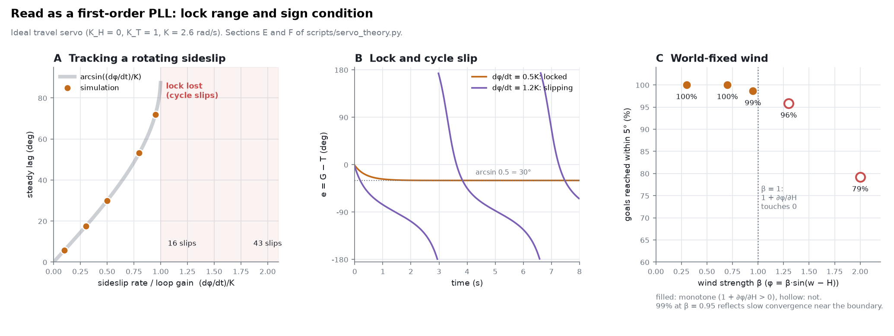

**Figure 4.** The loop read as a first-order PLL: ramp-tracking lag, lock and cycle slip, and the sign condition under world-fixed wind.

---

## 4. Measurement I: the front stage has the wiring but not the operation

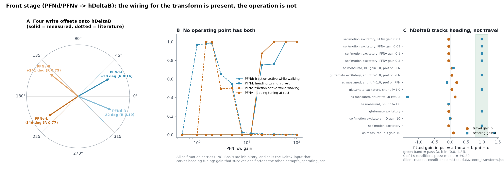

**Figure 5.** A: measured write offsets of the four PFN groups onto hΔB (solid) against the literature's bases (dotted); R is the concentration. B: PFN row-gain sweep. C: fitted heading and travel gains of hΔB in every condition tested.

### 4.1 The wiring matches the literature

Self-motion enters PFN through strictly lateralised, contralateral nodulus inputs. **LNO2 targets PFNd only. LNO1 splits 57% to PFNv and 43% to PFNd, and is PFNv's only self-motion input.** SpsP targets PFNd (99%) (`data/pfn_basis.json`). For each PFN group (PFNd/PFNv × PB left/right) we measured the offset between each PFN cell's own phase and the phase of the hΔB cells it writes to. hΔB phases are derived from connectivity.

| Group | Write offset | Concentration R | Literature |
|---|---:|---:|---:|
| PFNd-L | **+30°** | 0.16 | +45° |
| PFNd-R | **−22°** | 0.19 | −45° |
| PFNv-L | **−146°** | 0.77 | −135° |
| PFNv-R | **+141°** | 0.73 | +135° |

**The four-vector basis is present in the male connectome.** PFNd provides two forward-leaning bases and PFNv two backward-leaning ones, and **all 19 hΔB cells receive from all four groups.** Measured against Section 3.5, the wiring satisfies the geometric precondition, although the two PFNd offsets are only 52° apart, not 90°.

### 4.2 At the operating point the stage is out of service

Every self-motion entry is inhibitory: LNO1 is GABAergic, and LNO2, LNOa and SpsP are glutamatergic, treated as inhibitory through GluCl. PFN heading tuning, meanwhile, is carved by Δ7 inhibition. **Both the tuning and the self-motion signal arrive as subtraction.** At the model's operating point, PFNv never fires, and PFNd is silenced as soon as self-motion is applied.

Sweeping the PFN row gain from 0.5 to 100 (Figure 5B, `data/pfn_operating.json`) shows that **heading tuning and activity while walking are mutually exclusive.** At gains of 1–5 the tuning is present (R 0.5–0.98) but walking silences the cells; at 8–12 both are gone; from 20 upward the cells stay active while walking but the tuning is gone. A gain large enough to withstand the self-motion inhibition also flattens the tuning that Δ7 carved.

We then swept θ and φ independently in 45° steps and fitted hΔB's population-vector phase ψ with the circular regression ψ = a·θ + b·φ + c. A pass requires a and b in [0.8, 1.2], residual concentration ≥ 0.8 and amplitude linearity R² ≥ 0.9, all fixed in advance. The scoring was validated first: an ideal transformer gives a = b = 1.00 and passes, and a heading-only control gives a = 1.00, b = 0.00 and fails. **None of the 16 conditions passes** (Figure 5C). The conditions span sign assumptions, hΔ gain, shunting, and where the preference is assigned. hΔB tracks heading (a ≈ 1) and ignores travel direction (b between −0.05 and +0.20). Making glutamatergic inputs excitatory revives PFNd but not PFNv. The only living bases are then PFNd's two, which lie 52° apart, and a sum of vectors spanning a 52° cone cannot rotate through a full circle.

### 4.3 Declaring shunting inhibition: the stage wakes, the transform does not

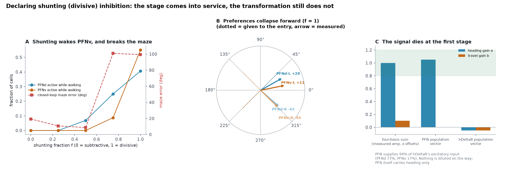

**Figure 6.** A: fraction of PFN active while walking, and the closed-loop maze error, against the shunting fraction f. B: effective φ preference of each group at f = 1 (arrows) against the preference given to its entry (dotted). C: heading and travel gain fitted stage by stage.

GABA-A and GluCl are both chloride channels, and chloride-mediated inhibition is physiologically closer to division than to subtraction. We therefore added one declared mechanism:

$$\mathrm{syn} = \frac{\text{excitation} - (1-f)\,\text{inhibition}}{1 + f\,k\,\text{inhibition}}$$

At f = 0 this is identical to the previous model to floating-point precision, a property fixed by a test (`tests/test_pi.py`), so all earlier numbers stand. Division scales gain while preserving the shape of the tuning, which is exactly what Section 4.2 lacked.

**At f = 1, PFNv fires for the first time** (55% active while walking), and PFNd and PFNv are simultaneously alive, heading-tuned and φ-modulated. **But the transformation still fails** (Figure 5C and Figure 6C). The stage-by-stage fit localises the failure:

| Stage (f = 1) | Heading gain a | Travel gain b |
|---|---:|---:|
| Theoretical four-basis sum (measured amplitudes × measured write offsets) | +1.00 | **+0.10** |
| PFN population vector | +1.05 | **+0.00** |
| hΔB population vector | −0.05 | −0.05 |

PFN supplies 94% of hΔB's excitatory input (PFNd 77%, PFNv 17%), so nothing is lost in the projection. **The signal dies at the first stage.** The reason is visible in Figure 6B. **An inhibitory entry flips a group's preference by 180°:** more drive means less activity. All four effective preferences therefore collapse forward (+29°, −42°, +11°, −45°) and modulate in phase, so their sum changes length without rotating. In addition, LNO1 inhibits PFNd (43% of its output) in anti-phase with the drive PFNd receives, so **the wiring itself cancels PFNd's φ modulation.**

The mechanism also has a cost. Strong shunting takes the closed-loop maze error from **19.3° to 99.3°**, beyond chance. In this model, "the transformation stage in service" and "steering works" do not hold at the same time.

### 4.4 What does reach PFN

With persistent sideslip, the PFN population vector does rotate slightly toward travel direction. Fitting (population angle − θ) = k·β + c gives an uptake **k = +0.117 ± 0.063** (95% CI, 20 × 20 trajectories; 0 = heading only, 1 = travel direction only). Three controls, each of which changes one thing, identify the route (Figure 7):

- equalising the left/right drive (keeping the sum) takes k to −0.003 ± 0.044;
- swapping left and right inverts it, to −0.114 ± 0.065;
- shuffling the PFN phase labels in the readout alone, with wiring and dynamics untouched, takes it to −0.034 ± 0.083.

**β reaches PFN only as a left/right drive ratio, and the glomerulus phase map turns that ratio into an angle.** This is a small, wiring-dependent effect in PFN populations other than PFNd/PFNv (which are silent), and it is not passed on to hΔ. It is not the vector transformation of Section 3.5.

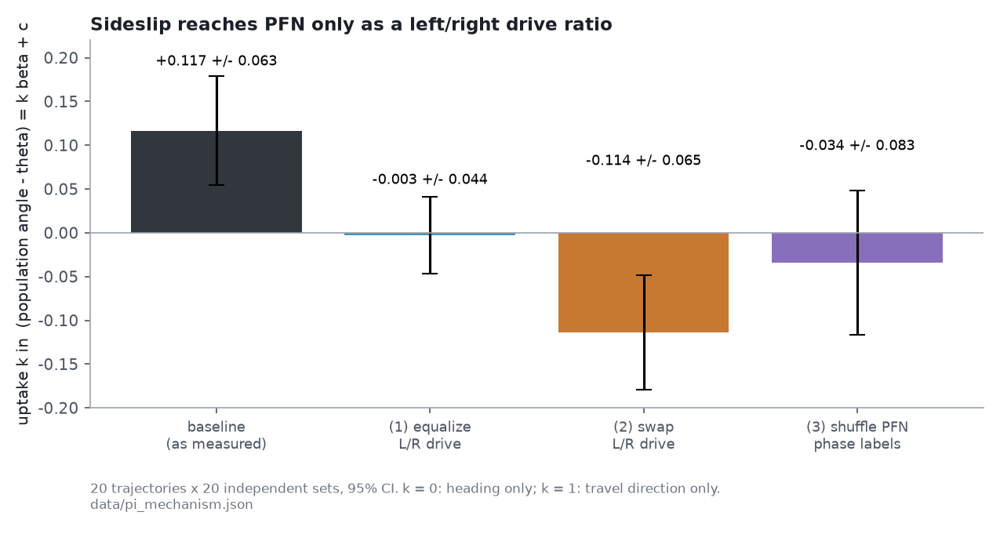

**Figure 7.** Uptake of sideslip by the PFN population vector, with three mechanism controls.

---

## 5. Measurement II: the back stage compares heading, not travel

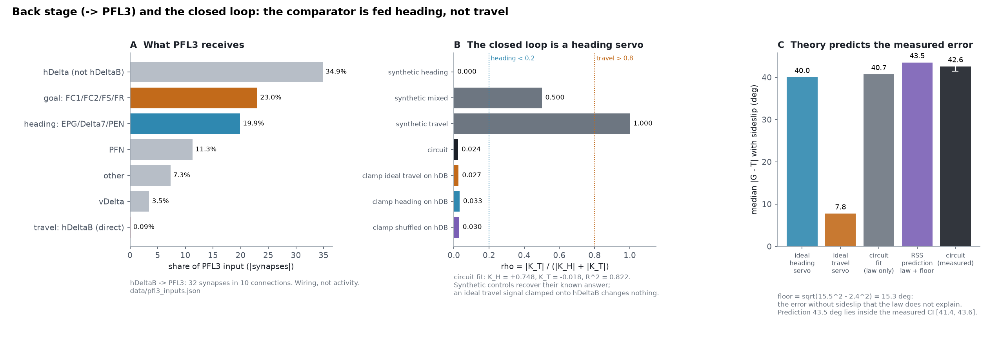

**Figure 8.** A: composition of PFL3's input by route (wiring). B: ρ from the closed-loop fit, for synthetic controls, the circuit and ideal signals clamped onto hΔB. C: task error with sideslip: ideal servos, the circuit's fitted law, the theoretical prediction and the measurement.

### 5.1 There is no wire from T to the comparator

PFL3's inputs by route (`data/pfl3_inputs.json`, |synapses|): hΔ types other than hΔB 34.9%, the goal route (FC1/FC2/FS/FR) 23.0%, the heading route (EPG/Δ7/PEN) 19.9%, PFN 11.3%, and **hΔB directly, 0.09%: 32 synapses in 10 connections.** A travel servo built literally as hΔB → PFL3 does not exist in the wiring. hΔB could reach PFL3 in two hops, mainly through hΔI (41%) and hΔA (39%) of the two-hop strength. Such a route would feed back a filtered, re-mapped T, and Section 5.2 shows it does not act as one.

The shifted comparator itself is carried by FC2. It enters PFL3 offset by about ±73° with left/right mirror symmetry (paper A), and it is compared against the unshifted EPG/Δ7 heading input.

### 5.2 Identifying the closed-loop control law

We removed one confound first: by default the goal was injected into both FC2 and hΔB. Injecting it into FC2 only gives a maze error of 16.4°; injecting it into hΔB only gives 100.0° (chance) (`data/servo_confound.json`). The goal therefore acts through FC2, and all fits below use FC2-only injection.

We then swept heading θ, goal G and sideslip φ over a grid (4 × 8 × 8), let the circuit settle, and fitted the steering output to

$$u = K_H\sin(G-H) + K_T\sin(G-T) + c$$

We validated the fit first: synthetic heading, travel and mixed controllers return their known K_H and K_T and the correct verdict. The circuit gives **K_H = +0.748, K_T = −0.018, c = −0.030, R² = 0.822, ρ = 0.024**. **It is a heading servo.** (The scoring script reports the sign-blind ρ = |K_T|/(|K_H| + |K_T|); with signs, K_T/(K_H + K_T) = −0.025. Either way it is close to 0.) By Section 3.4 it should reject about 2% of the sideslip; the slightly negative K_T makes the static error marginally exceed φ (Figure 2B).

**Clamping an ideal travel pattern onto hΔB changes nothing.** We clamped an ideal T bump directly onto hΔB, a heading bump as a control, and a phase-shuffled bump as a second control. They gave ρ = 0.027, 0.033 and 0.030, which cannot be told apart. Even a perfect T in hΔB does not reach the comparator.

---

## 6. Theory against measurement

### 6.1 The task

The task gives a goal at one of six directions and applies Ornstein–Uhlenbeck sideslip (σ = 55°, τ = 4 s, clipped at ±60°), 12 trials × 900 steps with a fixed seed. The median |φ| over the task is 40.0°.

| Controller | ρ | With sideslip (median) | Without |
|---|---:|---:|---:|
| ideal heading servo | 0.000 | 40.0° | 0.0° |
| circuit's fitted law, without the circuit | 0.024 | 40.7° | 2.4° |
| ideal travel servo | 1.000 | 7.8° | 0.0° |
| **the circuit itself** | — | **42.6° [41.4, 43.6]** | **15.5° [15.0, 18.0]** |

The idealised loops use the same seed as the circuit experiment. The ideal heading and travel servos reproduce the synthetic controls stored with that experiment bit for bit (7.8° / 40.0°), which confirms that the two task implementations are the same.

### 6.2 Decomposing the circuit's error

The circuit's 42.6° has two parts.

1. **The control law.** The fitted law alone gives 40.7° with sideslip; the static part (1 − ρ)|φ| accounts for nearly all of it, because ρ is close to 0.
2. **A floor outside the law.** Without sideslip the circuit still errs by 15.5°, where its law gives 2.4°. We attribute the difference to circuit time constants, dead zones and fit residuals, none of which the fitted equation contains. Assuming the two parts are independent and their medians combine as a root sum of squares, the floor is √(15.5² − 2.4²) = 15.3°.

**Prediction:** √(40.7² + 15.3²) = **43.5°**. **Observed: 42.6° [41.4, 43.6].** The prediction lies inside the interval.

The ideal travel servo's 7.8° is not zero, for the reason given in Section 3.7: a first-order loop lags a fluctuating disturbance. Raising the loop gain from 2.6 to 20 rad/s reduces the lag from 7.8° to 3.0° (Figure 2C). The lag is a property of the loop gain, not of which quantity is fed back.

### 6.3 Where the wiring falls short, stage by stage

Putting Sections 3–5 together:

| Requirement (theory) | Wiring | At the operating point |
|---|---|---|
| Four bases ~90° apart write onto hΔB (Section 3.5) | **present**: +30/−22/−146/+141°, 19/19 cells converge | PFNv silent, PFNd silenced by walking |
| Velocity *scales* the heading bump (multiplication, Section 3.5) | inhibitory entries, subtractive in the base model | shunting gives division, but flips preferences by 180° |
| T reaches the comparator (Section 3.1) | **absent**: hΔB → PFL3 is 0.09% | an ideal T clamped onto hΔB is ignored (ρ = 0.027) |
| The comparator subtracts angles (squaring, Section 3.6) | the shifted comparator compares G with **H** | fitted K_T = −0.018 |
| K_T > 0 and K_H + K_T > 0 (Section 3.4) | — | K_H + K_T = 0.730 > 0: stable, as a heading servo |

---

## 7. Supplying the missing multiplications: an added circuit

Sections 3–6 say *what* is missing. Here we add it and measure what it buys. We attach both operations of Section 3 to the connectome model as a declared, added circuit, calibrate it once on training grids, freeze it, and then evaluate it with the criteria and the task used for the plain circuit. We also run ablations, controls and robustness tests on it. Nothing in the base model changes: with every added mechanism switched off, the dynamics are bit-identical to the base model (`tests/test_servo_augmented.py`).

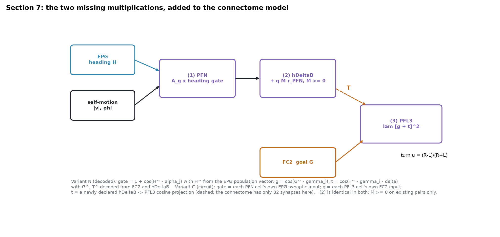

**Figure 9.** The added circuit. (1) multiplies each PFN group's velocity projection into its heading bump. (2) adds non-negative weights on existing PFN → hΔB pairs. (3) squares the sum of a goal wave and a travel wave in each PFL3 cell. The dashed arrow is the hΔB → PFL3 route that the connectome lacks.

### 7.1 What is added, and what each variant is allowed to use

We built two variants to separate the operations themselves from the shortcut of reading angles out of population activity.

- **N (decoded).** The added terms use angles decoded from population vectors: Ĥ from EPG, Ĝ from FC2 and T̂ from hΔB.
- **C (circuit).** Nothing is decoded. The multiplication gates each PFN cell's own EPG synaptic input. The comparator squares the sum of each PFL3 cell's own FC2 input and a **newly declared hΔB → PFL3 cosine projection**, since the connectome carries only 32 synapses on that route (Section 5.1).

The three mechanisms are:

1. **PFN multiplication.** PFN cell j in group g (PFNd/PFNv × PB side, p_g = ±45°, ±135°) receives m·A_g·gate_j, with A_g = |v|·[cos(φ − p_g)]₊. In N the gate is 1 + cos(Ĥ − α_j); in C it is the cell's EPG input divided by a calibrated scale. The native PFN input is scaled by ν_P.
2. **hΔB alignment.** hΔB cell i receives q·Σ_j M_ij r_j, with **M ≥ 0 and non-zero only on PFN → hΔB pairs that exist in the connectome**. M is fitted once by non-negative least squares, through the inverse of the activation function, so that hΔB activity follows |v|·[cos(ψ_i − (θ + φ))]₊. The native hΔB input is scaled by ν_B = 0.5.
3. **PFL3 squaring comparator.** PFL3 cell i (phase γ_i, side s) receives λ·[g_i + t_i]², with δ_L = +90° and δ_R = −90° as in Section 3.6. In N, g_i = cos(Ĝ − γ_i) and t_i = cos(T̂ − γ_i − δ_s). In C, g_i is the cell's FC2 input (which already carries the measured ±73° offset), and t_i is the declared projection Σ_k r_k·cos(ψ_k − c_T − γ_i − o_s − δ_s).

**Calibration, fixed before any evaluation.** Two rules chose the parameters:

- **Front stage:** m and ν_P maximise (a and b in band, residual concentration, amplitude R²) on the training grid (θ, φ in 45° steps).
- **Back stage:** λ is the smallest value in {0.02, 0.05, 0.1, 0.2, 0.4} that gives ρ > 0.9, K_T > 0 and R² ≥ 0.5 on a training grid offset by 45°/22.5° from the evaluation grid.

The rules chose:

| Variant | m | ν_P | λ | Non-zero M | PFN / hΔB cells used by M |
|---|---:|---:|---:|---:|---:|
| N | 0.1 | 0.25 | 0.1 | 125 | 35 / 19 |
| C | 0.4 | 0.25 | 0.2 | 185 | 48 / 19 |

Evaluation grids are disjoint from the training grids. The front stage has a held-out grid shifted by 22.5°. The closed-loop task uses the same seeds, goals and OU sideslip as Section 6, and the criteria are those of Sections 4 and 5, plus K_T > 0.

### 7.2 Performance

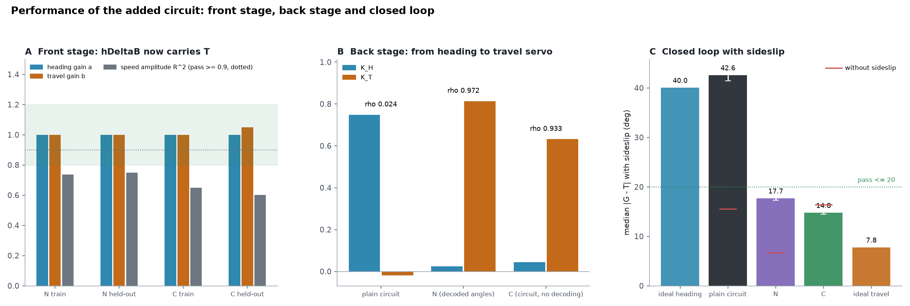

**Figure 10.** A: circular regression of hΔB's population vector on the training and held-out grids. B: closed-loop control law. C: travel error with sideslip, with the error without sideslip marked in red.

**Front stage (E1).** hΔB now carries the travel direction. On the held-out grid variant N gives a = 1.00, b = 1.00 and residual concentration 0.938; variant C gives a = 1.00, b = 1.05 and 0.944. This compares with b between −0.05 and +0.20 in every condition of Section 4. **The pre-registered amplitude criterion fails, however:** the population vector's length tracks speed with R² = 0.749 (N) and 0.603 (C), against a required 0.9. The readout geometry allows up to 0.95, since the 19 hΔB phases are unevenly spaced. The shortfall comes from PFN and hΔB thresholds and saturation, and refitting M against its own output did not remove it. **The direction of T is built; its magnitude is not linear in speed.**

**Back stage (E2).** The loop becomes a travel servo. Variant N gives **K_H = +0.024, K_T = +0.814, ρ = 0.972 (R² = 0.800)**; variant C gives **K_H = +0.045, K_T = +0.632, ρ = 0.933 (R² = 0.808)**. The plain circuit had K_H = +0.748, K_T = −0.018. Both variants pass, K_T > 0 included.

**Closed loop (E3).**

| Controller | With sideslip (median [95% CI]) | 90th percentile | Without sideslip |
|---|---:|---:|---:|
| ideal heading servo | 40.0° | | 0.0° |
| plain circuit | 42.6° [41.4, 43.6] | 90.8° | 15.5° [15.0, 18.0] |
| **added circuit N** | **17.7° [17.3, 18.1]** | 41.7° | **6.7° [5.5, 7.9]** |
| **added circuit C** | **14.8° [14.5, 15.1]** | 38.5° | **16.4° [3.2, 20.5]** |
| ideal travel servo | 7.8° | | 0.0° |

Both variants pass the closed-loop criteria: at most 20° with sideslip, and without sideslip no worse than the plain circuit's upper confidence bound of 18.0°. The error with sideslip improved in 11 of 12 trials for N and in 12 of 12 for C. Neither variant reaches the ideal travel servo, and the tails are long: the 90th percentile stays near 40°. C's error without sideslip has a wide interval, and its median sits just below the criterion.

**The decomposition of Section 6.2 does not carry over.** The fitted laws alone give 8.7° (N) and 9.8° (C) with sideslip. The effective loop gains are K·(K_H + K_T) = 2.18 and 1.76 rad/s, slightly below the ideal travel servo's 2.6. Adding the floor measured without sideslip as a root sum of squares predicts 10.9° for N (observed 17.7°) and 19.1° for C (observed 14.8°): once under, once over. With the added circuit, the error without sideslip is no longer independent of the sideslip-driven error. The additivity assumption that held for the plain circuit fails here, and we do not use it for these circuits.

### 7.3 Ablations and controls

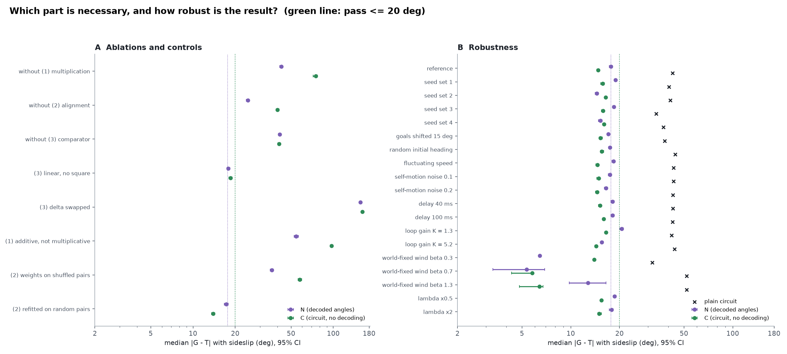

**Figure 11.** A: removing or altering one part at a time. B: robustness, with the plain circuit under the same conditions (×). Median travel error with sideslip and 95% CI. The dotted green line is the 20° criterion.

| Condition | N: K_T, ρ | N: error | C: K_T, ρ | C: error |
|---|---:|---:|---:|---:|
| full added circuit | +0.814, 0.972 | 17.7° | +0.632, 0.933 | 14.8° |
| without (1) multiplication | −0.018, 0.024 | 42.6° | +0.003, 0.023 | 74.9° |
| without (2) alignment | +0.340, 0.385 | 24.6° | +0.111, 0.319 | 40.1° |
| without (3) comparator | −0.028, 0.037 | 41.5° | −0.026, 0.035 | 41.1° |
| (3) linear, no square | +0.597, 0.971 | 17.8° | +0.440, 0.903 | 18.5° |
| (3) δ_L, δ_R swapped | −0.818, 0.949 | 156.3° | −0.639, 0.943 | 161.2° |
| (1) additive instead of multiplicative | +0.372, 0.906 | 54.4° | −0.025, 0.824 | 97.3° |
| (2) fitted weights moved to shuffled existing pairs | +0.497, 0.984 | 36.5° | +0.208, 0.684 | 57.7° |
| (2) refitted on degree-matched random pairs | +0.832, 0.971 | 17.3° | +0.653, 0.940 | 13.9° |

- **Both multiplications are necessary.** Without (1), PFN stays silent at the operating point (Section 4.2), hΔB carries nothing, and the loop reverts to the plain heading servo; for N the numbers are essentially those of the plain circuit. Making (1) additive leaves hΔB's travel gain at b = 0.00 (N) and 0.55 (C) and the error at 54° and 97°. This is the prediction of Section 3.5: velocity enters only as a per-group constant, and a constant cancels over the cells.
- **The comparator is necessary, and its sign is as theory predicts.** Removing it restores K_T ≈ 0. Swapping δ keeps ρ high (0.949, 0.943) but flips K_T negative, and the loop settles near 180° (156°, 161°). This is exactly the case Section 3.4 warns about: a high sign-blind ρ with the wrong sign of K_T.
- **The square itself turned out not to be essential.** A linear comparator steers almost as well (17.8°, 18.5°). Section 3.6 shows that a linear sum carries no G − T information for evenly spaced cells. The PFL3 phases are uneven, however, and each PFL3 cell's threshold rectifies its input, and that rectification supplies the product. This is the mechanism anticipated in Section 8.2: a threshold can stand in for a multiplication.
- **Alignment matters, but the connectome's specific pairs do not.** Without (2), ρ falls to 0.385 (N) and 0.319 (C). Keeping the fitted values but moving them to shuffled existing pairs fails (36.5°, 57.7°). Refitting on degree-matched *random* PFN → hΔB pairs, which need not exist in the connectome, works as well as or better than refitting on real pairs (17.3°, 13.9°). **The existing wiring is a sufficient substrate for (2), but it is not a special one.**

### 7.4 Robustness

Each condition changes one thing relative to the task of Section 6 (12 trials, sideslip σ = 55°). Values are the median travel error; the plain circuit is shown for reference.

| Condition | Plain circuit | N | C |
|---|---:|---:|---:|
| reference | 42.6° | 17.7° | 14.8° |
| four other seed sets (range) | 33.6–41.1° | 14.5–18.9° | 15.8–16.5° |
| goals shifted by 15° | 38.0° | 17.0° | 15.3° |
| random initial heading | 44.2° | 17.5° | 15.6° |
| fluctuating speed (OU, 0.5–1.5) | 43.1° | 18.4° | 14.6° |
| self-motion noise, sd 0.1 / 0.2 | 43.1° / 42.7° | 17.5° / 16.5° | 14.9° / 14.6° |
| sensory delay 40 ms / 100 ms | 42.6° / 42.5° | 18.1° / 18.1° | 15.2° / 16.0° |
| loop gain K = 1.3 / 5.2 rad/s | 41.8° / 43.7° | 20.6° / 15.5° | 16.5° / 14.3° |
| world-fixed wind β = 0.3 / 0.7 / 1.3 | 31.9° / 51.9° / 51.8° | 6.4° / 5.3° / 12.8° | 13.9° / 5.8° / 6.4° |
| λ × 0.5 / × 2 | — | 18.6° / 17.8° | 15.5° / 15.0° |

The improvement survives every condition we tried. Across four independent seed sets both variants stay between 14° and 19°. Noise on the self-motion input barely matters, and delays of 40 and 100 ms add at most 1.2°. Halving or doubling λ changes the error by less than 1°. As Section 3.7 predicts, lowering the loop gain to 1.3 rad/s raises the error (N 20.6°, just past the criterion), and raising it to 5.2 rad/s lowers it.

With world-fixed wind the added circuits reach small errors even at β = 1.3, beyond the sign boundary of Section 3.8 (β < 1 guarantees every direction). This is not a contradiction. Here the wind has a single fixed direction per run, and a sign reversal only makes some goal directions unreachable; the task's six goals do not all fall in that region.

### 7.5 What this does and does not show

It shows that **the two operations derived in Section 3 are sufficient, on this connectome model, to turn the heading servo into a travel servo**. The front stage then builds T from the existing PFN → hΔB wiring. The loop gains a positive K_T. The sideslip error falls from 42.6° to 15–18°, and the gain survives seeds, noise, delay and speed changes. It also shows **which parts are necessary**: both multiplications and the correctly signed comparator. And it shows **which are not**: the exact square (threshold rectification suffices) and the connectome's specific PFN → hΔB pairs.

It does not show that the fly computes this way. Every added term is declared, not measured. Variant N reads angles out of populations. Variant C avoids decoding but still needs a new hΔB → PFL3 projection that the connectome does not contain, and a gain-modulated PFN input whose biological form is unknown. The speed amplitude of T fails its criterion in both variants. The added circuits also remain far from the ideal travel servo in their tails: the 90th percentile is about 40°.


## 8. Discussion

### 8.1 What is missing are two multiplications

A travel servo needs angle addition in the front stage and angle subtraction in the comparator, and both are bilinear (Sections 3.5–3.6). The circuit is a heading servo because its comparator receives H, not T. It does not receive T for two reasons: the stage that would build T is not in service at the operating point, and no wire carries a T to the comparator.

Section 7 tests the converse. Supplying the two operations turns the same wiring into a travel servo, and removing either one undoes it. Once PFN is multiplicatively gated, the existing PFN → hΔB projection builds T. The missing hΔB → PFL3 route, however, had to be declared.

### 8.2 How far does "an additive circuit cannot do it" hold?

For purely linear summation the statement is exact: rotation is bilinear, and no parameter setting of a weighted sum produces it. It does not transfer directly to circuits with a threshold. Half-wave rectification [a + b − θ]₊ can approximate gain modulation of a wherever b acts as a gate, and in flies PFN activity amplitude is reported to be modulated by the direction of self-motion [Lyu et al. 2022; Lu et al. 2022]. So the animal does something close to multiplication. Section 7.3 found a concrete case in this model: with a linear comparator, PFL3's own threshold rectification recovered almost all of the squaring comparator's performance (17.8° vs 17.7°). Our model uses a rectifying nonlinearity, and still no tested operating point produced the transform. That is strong evidence that none exists *in this model with these assumptions*. It is not an impossibility proof. The failures were conjunctive: PFN must be alive, heading-tuned, φ-modulated and have spread preferences, all at once. A search that moves one knob at a time may miss such points.

### 8.3 Dale's law and candidate implementations

A square is non-negative whatever the sign of its argument. Built from cells that are each excitatory or inhibitory, it needs two opposite-signed pathways, such as [x]₊² + [−x]₊². Multiplying a heading bump by a velocity projection with inhibitory entries runs into the 180° flip of Section 4.3. The wiring does offer candidates for gain control: LNO-driven modulation of PFN, normalisation through Δ7, and two-hop routes through the hΔ types. Our data do not single any of them out.

### 8.4 Is a heading servo a failure?

Not necessarily. Without sideslip the circuit follows goals to 15.5°. Tethered-fly experiments find PFL3 comparing heading with the goal [Westeinde et al. 2024; Mussells Pires et al. 2024], consistent with a heading servo. Sideslip might instead be cancelled downstream, for example by optic-flow reflexes outside the central complex. What this paper establishes is what the central complex would need in order to cancel sideslip by itself.

### 8.5 Related work

An alternative model, produced by another AI system from the same data package, added three mechanisms from outside the model's parameter bounds: a multiplicative PFN stage, reweighted PFN → hΔB synapses and a squaring PFL3 comparator. It reported travel-servo behaviour. We could not reproduce it and cite none of its numbers. Structurally, the two multiplications it added are the operations Section 3 shows to be necessary.

---

## 9. Limitations

- **Idealised plant.** Ḣ = K·u has no body inertia and no sensory delay. Section 3.4 assumes constant φ, and Section 3.7 constant dφ/dt.
- **The fitted law is a description, not a derivation.** K_H and K_T summarise the input–output behaviour of the circuit on a grid; they are not computed from the wiring.
- **The root-sum-of-squares decomposition** (Section 6.2) assumes independent components and has been checked on one circuit.
- **Signs are predictions.** Glutamate is taken as inhibitory. Taking it as excitatory revives PFNd but not PFNv, whose dominant inhibitor, LNO1, carries a ground-truth GABA label.
- **Shunting is declared.** Every number in Section 4.3 rests on a mechanism we added, not on the wiring. Assigning the preference on the PFN side was added after the first failure and was not fixed in advance; it failed as well.
- **Wiring is data; the rest is assumption.** Thresholds, gains, injection sites and readouts are assumptions of this project, not properties of the connectome (Section 2).
- **The added circuit is declared (Section 7).** Its operations, parameters and, in variant C, the hΔB → PFL3 projection are ours. Parameters were chosen on training grids by rules fixed in advance, and the grid of candidate values is small. A different choice of candidates could give different numbers. The speed amplitude of T fails its criterion, and the error-budget decomposition of Section 6.2 does not transfer to the added circuits.

---

## 10. Conclusions

1. To reject sideslip, a steering loop must feed back the controlled quantity T. In the mixed law, ρ is the disturbance-rejection ratio, and stability additionally requires K_T > 0 and K_H + K_T > 0.
2. A travel servo needs two bilinear operations: multiplication to add angles (T = H + φ) and squaring to subtract them (G − T). Together they give a loop isomorphic to a first-order PLL, with a lock range and a ramp lag set by the loop gain.
3. The male connectome contains the wiring of the front stage: four bases near ±45°/±135° converging on all 19 hΔB cells. At every operating point we tested, the stage does not operate. Inhibitory entries silence it, and under shunting they flip its preferences.
4. The comparator receives heading, not travel. The closed loop is a heading servo (K_H = +0.748, K_T = −0.018, ρ = 0.024), and theory predicts its sideslip error (43.5° predicted, 42.6° [41.4, 43.6] measured).
5. **Wiring is a necessary condition, and the male connectome meets it. It is not sufficient: the missing pieces are two multiplications.**
6. Supplying those two operations as an added circuit is sufficient in this model. Sideslip error falls from 42.6° to 15–18° with K_T > 0, both with decoded angles and without them, and the gain is robust to seeds, noise, delay and speed. Both multiplications and the comparator's sign are necessary; the exact square and the connectome's specific PFN → hΔB pairs are not.

---

## Appendix A. Supplementary derivations

**A.1 Linear error under OU sideslip.** The linearised loop is e(s) = −(s + K·K_H)/(s + K(K_H + K_T))·φ(s). With the OU spectrum 2σ²a/(ω² + a²), a = 1/τ,

$$\mathrm{Var}\,e = \sigma^2\left[A + B\,\frac{a}{\alpha}\right],\quad A=\frac{\beta^2-a^2}{\alpha^2-a^2},\ B=\frac{\alpha^2-\beta^2}{\alpha^2-a^2}$$

where α = K(K_H + K_T) and β = K·K_H. For an ideal travel servo (β = 0), Var e = σ²·a/(a + α), so the error falls as 1/√K. This is the dashed line in Figure 2C. It ignores the ±60° clip, so it lies above the simulation.

**A.2 γ-average of the square.** Expanding [cos(G − γ) + cos(T − γ − δ)]², each cos² term averages to 1/2 over γ. The cross term is 2cos(G − γ)cos(T − γ − δ) = cos(G − T + δ) + cos(G + T − 2γ − δ), and the second part sums to zero over N ≥ 3 equally spaced cells.

## Appendix B. Verification tests

`tests/test_servo_theory.py` (numpy only) fixes:

| # | Content |
|---|---|
| 1 | with φ = 0, heading and travel servos trace the same trajectory |
| 2 | the steady error under constant φ equals (1 − ρ)φ (small angle, K_H, K_T > 0) |
| 3 | sweeping φ around the circle, the phasor-sum phase is H + φ |
| 4 | K_H + K_T < 0 moves the equilibrium to the π side |
| 5 | the ramp-tracking lag is arcsin((dφ/dt)/K); cycles slip when |dφ/dt| > K |
| 6 | world-fixed wind with β < 1 lets every direction be reached |
| 7 | the synthetic task values are reproduced bit for bit with the same seed |
| 8 | the squaring comparator gives sin(G − T) exactly for 12 cells; the linear sum is 0 |
| 9 | the root-sum-of-squares decomposition predicts the circuit's error within its CI |

`tests/test_servo_augmented.py` fixes the added circuit of Section 7: bit-identical dynamics with every mechanism off, M ≥ 0 only on existing PFN → hΔB pairs, the sign of the squaring comparator and its reversal when δ is swapped, the delay line, the multiplicative versus additive gate, and that the saved results follow the calibration rule and reproduce the plain circuit.

`tests/test_papers_en.py` checks every number quoted in this paper against `paper/data/paper_b_measurements.json`, which `paper/scripts/fig_b.py` copies from `data/*.json`.

## Appendix C. Self-corrections

1. **A sign-blind ρ.** Our scoring (`scripts/servo_identify.py`) defines ρ = |K_T|/(|K_H| + |K_T|), which approaches 1 even when K_T < 0. All synthetic controls had K_T ≥ 0, so the flaw stayed hidden. It does not change this paper's verdict (the circuit's K_T is small and ρ ≈ 0), but a travel-servo verdict must also require K_T > 0.
2. **The equilibrium finder dropped roots at ±π.** A root exactly on a grid endpoint was missed, so at φ = 0 the e = π equilibrium went undetected. Test 4 exposed it; the grid is now offset by half a step and scanned periodically.
3. **The injection confound.** Early servo fits injected the goal into both FC2 and hΔB. Removing hΔB from the injection (Section 5.2) changed the maze error by less than its confidence interval, and all fits here use FC2 only.

---

## Reproduction

```
pip install numpy scipy matplotlib markdown
python3 scripts/servo_theory.py        # theory checks -> data/servo_theory.json (seconds)
python3 scripts/servo_augmented.py     # section 7: calibrate, evaluate, ablate, stress (about 30 min)
python3 tests/test_servo_augmented.py  # unit tests for the added circuit
python3 paper/scripts/fig_b.py         # number sheet + figures for this paper
python3 tests/test_servo_theory.py     # regression tests for Section 3
python3 tests/test_papers_en.py        # numbers in this paper against the data
```

The circuit measurements were produced by `scripts/pfn_basis.py`, `scripts/pfn_operating.py`, `scripts/coord_transform.py`, `scripts/shunting.py`, `scripts/coord_localize.py`, `scripts/pfl3_inputs.py`, `scripts/servo_confound.py`, `scripts/servo_identify.py`, `scripts/servo_ideal_hdb.py`, `scripts/bearing_vs_homing.py` and `scripts/mechanism_control.py`. Their outputs are in `data/`.

## References

1. Lyu, C., Abbott, L. F. & Maimon, G. Building an allocentric travelling direction signal via vector computation. *Nature* **601**, 92–97 (2022).
2. Lu, J. *et al.* Transforming representations of movement from body- to world-centric space. *Nature* **601**, 98–104 (2022).
3. Westeinde, E. A. *et al.* Transforming a head direction signal into a goal-oriented steering command. *Nature* **626**, 819–826 (2024).
4. Mussells Pires, P. *et al.* Converting an allocentric goal into an egocentric steering signal. *Nature* **626**, 808–818 (2024).
5. Hulse, B. K. *et al.* A connectome of the *Drosophila* central complex reveals network motifs suitable for flexible navigation and context-dependent action selection. *eLife* **10**, e66039 (2021).
6. MaleCNS connectome, Janelia FlyEM and collaborators. Dataset v1.0, CC-BY 4.0. <https://male-cns.janelia.org/>
7. Best, R. E. *Phase-Locked Loops: Design, Simulation, and Applications*, 6th ed. McGraw-Hill (2007).
8. Companion paper A: `paper/a_navigation/PAPER.md` (this repository).
